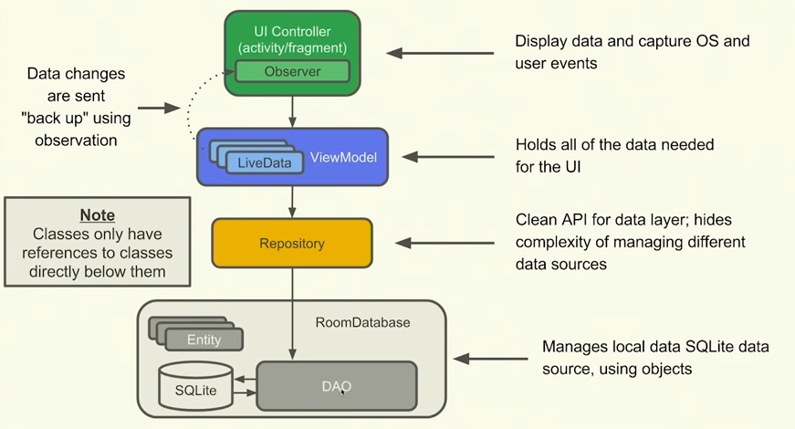

# Mirae 

# Mirae App In Action
Mirae is a simple Todo application that lets users to create, update or delete todo list 
as well as sort them on the basis of priority. The app also provides a search menu to 
search for the list based on either the title or subtitle.
[[keep the live gif file of it working]]

# MVVM Architecture
My Android application adheres to the MVVM architectural pattern, which helps organize the 
code in a better way. This design separates different parts of the app so that they don't get 
mixed up and become hard to work with. 

## Folder Structure

# Features of Mirae App
## Basic Features
Splash Screen

Add a todo item

Update a todo item

Delete a todo item

Persistence

Rotation Fix

## Additional Features
Search on the basis of Title or Subtitle

Sort on the basis of priority

Validation